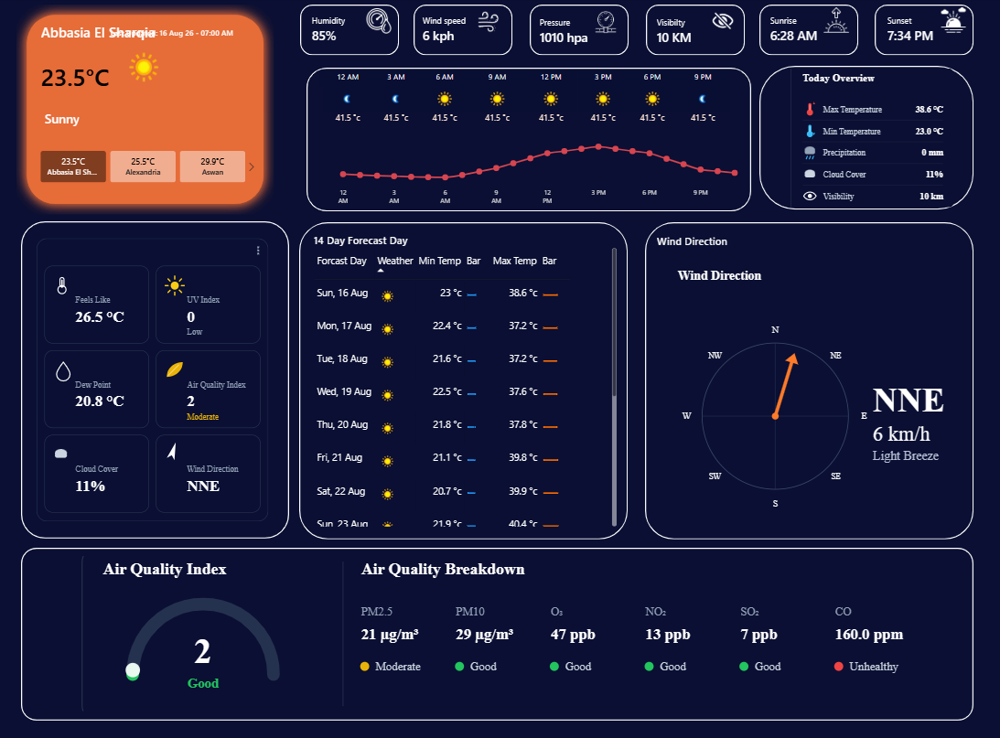

# 🌦️ Real-Time Weather Analytics Dashboard | Power BI

> **Turning a live Weather API into a single, self-contained analytical dashboard — current conditions, hourly trend, 14-day forecast and air quality, in one view.**

A Power BI dashboard built to transform live weather API data into a clean, interactive experience covering **current conditions, hourly and 14-day forecasts, wind, and air quality**.

This project covers the full journey from **API integration and data transformation, to data modeling, DAX measures, DAX-generated SVG visuals, and dashboard design**.

---

## 📌 Project Overview

The goal was not simply to display weather numbers on cards.

The goal was to take a raw weather API response, understand its structure, transform it into an analytical model, and turn it into a single dashboard page that reads at a glance — current weather, what's coming in the next few hours and days, and how safe the air is to breathe.

### Dashboard Scope

- 🏙️ Multi-city switcher (current build covers Abbasia El Sharqia, Alexandria and Aswan)
- 🌡️ Current conditions (temperature, condition text, feels like)
- 📈 Hourly temperature trend
- 📅 14-day forecast with min/max temperature and in-cell data bars
- 💧 Humidity, dew point and cloud cover
- 💨 Wind speed and a dynamic wind-direction compass
- 🌧️ Precipitation and visibility
- 🌅 Sunrise and sunset
- 🌫️ Full air quality breakdown (PM2.5, PM10, O₃, NO₂, SO₂, CO)
- 🎯 Overall Air Quality Index gauge with dynamic status coloring
- 🕐 Last-updated timestamp

---

## 🎯 Project Objectives

The project was built to:

- Connect Power BI to a live weather API and retrieve current, hourly and daily forecast data.
- Transform a deeply nested JSON API response into clean, structured analytical tables.
- Build a proper star-schema data model (dimensions + fact tables).
- Develop reusable DAX measures, organized in a dedicated measures table.
- Go beyond native visuals by generating custom graphics (a wind compass, an air-quality gauge, and summary panels) directly with DAX-produced SVG.
- Present air quality in a way that is immediately understandable, not just a wall of numbers.
- Package all of this into a single, dense but readable dashboard page.

---

## 🔌 1. API Integration

The dashboard is powered by a live **Weather API** (WeatherAPI-style JSON — location, current conditions, hourly forecast, daily forecast and air quality all returned in one nested response).

Power BI connects to the API through Power Query, which requests, per selected location:

- Location metadata
- Current weather conditions
- Multi-day (14-day) forecast
- Hourly forecast
- Air quality data

### 🔐 API Security — please read before you touch the credentials

The M query is written to pull weather data through a Web API connection rather than a plain hard-coded URL string. As with any project like this:

- The API key **must** be supplied through Power BI's own Web API credential mechanism (Data Source Settings → Edit Permissions), **not** typed directly into the M code as plain text.
- Before this repository goes public, double-check the Power Query **Advanced Editor** for every query step and confirm no key, token, or account identifier is hard-coded anywhere in the M code.
- If a key is ever found hard-coded in a query that has already been shared, revoke/rotate that key immediately from the API provider's dashboard.

> **Note on refreshing the public file:** whoever downloads this `.pbix` needs to plug in **their own** Weather API key via Power BI's credential manager before hitting Refresh — the file does not ship with a working credential.

---

## 🧹 2. Data Transformation & Cleaning

The raw API response is a set of nested records and lists (location → current → forecast → forecastday → hour/day → condition/air_quality). Power Query is used to progressively expand these structures into flat, analytical tables:

- Expanding location, current-weather, forecast, daily-forecast and hourly-forecast records.
- Expanding nested weather-condition and air-quality records.
- Removing unused columns and renaming fields to consistent, readable names.
- Assigning correct data types (dates, times, decimals).
- Handling invalid/edge-case values coming back from the API before type conversion.

---

## 🏗️ 3. Data Model

The model is organized around one location dimension and three fact tables at different grains, plus a dedicated measures table:

```text
Location
│
├── AllData            (current conditions — one row per location)
├── ForcatDay           (daily / 14-day forecast — one row per forecast day)
└── ForcastHour          (hourly forecast — one row per forecast hour)

Measures KPI            (all DAX measures, including the DAX-generated SVG visuals)
```

Relationships between `Location` and the three fact tables drive the city switcher, so picking a location filters every visual on the page at once.

---

## 🧮 4. DAX Measures & DAX-Generated SVG Visuals

All calculations live in a dedicated **Measures KPI** table, kept separate from the fact tables. This includes standard scalar measures (temperature, humidity, wind speed, pressure, visibility, sunrise/sunset, last-update) and something a bit more unusual:

### Custom visuals built entirely with DAX

Several of the dashboard's most distinctive elements are not native Power BI visuals at all — they are **SVG images generated dynamically by DAX measures** and rendered inside card visuals:

- **Wind Compass** — a rotating compass graphic pointing in the live wind direction.
- **Air Quality gauge** — the circular AQI indicator with a color that changes based on the current value.
- **Today Overview panel** — the max/min temperature, precipitation, cloud cover and visibility summary block.
- **Overview grid** — the small multi-metric grid layout.

This lets the dashboard show fully custom, data-driven graphics that update live with the selected city and time — something that's hard to achieve with out-of-the-box chart types.

---

## 📅 5. Forecast & Trend Analysis

- **14-Day Forecast table** — day, weather icon, min/max temperature, each rendered with in-cell data bars for a quick visual comparison across the two-week horizon.
- **Hourly temperature trend** — a line chart of temperature by hour label, plus an alternate pivot-table view pairing the hourly icon with the hour's forecast temperature.

---

## 🌫️ 6. Air Quality Analysis

Air quality is one of the dashboard's main analytical sections. The API supplies the following pollutant readings, all surfaced on the dashboard:

- PM2.5
- PM10
- O₃ (Ozone)
- NO₂
- SO₂
- CO

Each pollutant is shown with its concentration and a status indicator (Good / Moderate / Unhealthy, etc.), alongside an overall AQI gauge — so the user gets both the granular numbers and an instant read on air safety, without needing to interpret every value manually.

---

## 🎨 7. Dashboard Design

The layout groups information into clearly separated zones on a single dense canvas:

- Current conditions + multi-city switcher at the top.
- Hourly trend and a "Today overview" summary side by side.
- 14-day forecast table and wind-direction compass.
- Air Quality Index gauge and full pollutant breakdown along the bottom.

A dark theme with warm orange weather accents is used throughout for contrast and readability.

---

## 🖼️ Dashboard Preview



---

## 🛠️ Tools & Technologies

| Technology | Purpose |
| --- | --- |
| **Power BI** | Data modeling, DAX and dashboard visualization |
| **Power Query (M)** | API integration, transformation and cleaning |
| **DAX** | Measures, dynamic calculations and generated SVG visuals |
| **Weather API** | Live weather, forecast and air-quality data source |
| **JSON** | API response structure |
| **GitHub** | Project documentation and version control |

---

## 🚀 Possible Next Steps

- Expand city coverage beyond the current locations.
- Add historical weather data for trend analysis over time.
- Add a geographic map view for exploring conditions by location.
- Package the DAX-SVG techniques (compass, gauge) as a small reusable measure-group template for other Power BI projects.

---

## 🔐 Data & Security

- This repository is not meant to contain any private API credential.
- The API key must be supplied through Power BI's own Web API credential manager, kept outside of the public `.pbix`/M code.
- **Never publish:** API keys, passwords, private credentials, or any other sensitive configuration values.
- If a credential is ever found exposed in this or any other public repository, revoke/rotate it immediately with the provider.

---

## 👨‍💻 About Me

### Mohamed Farag

**ERP Systems & Data Analytics Specialist | Data Engineering | Odoo & SAP & PowerBuilder Developer | Python, SQL | Flutter**

Based in Jeddah, Makkah — working on ERP systems and data analytics at Al-Nasseej Al-Arabi Factory.

I enjoy turning raw, messy data (including live APIs) into structured models and dashboards that make information easy to explore and act on.

### Skills

<p>


</p>

---

## ⭐ Project Takeaway

This project started with a simple question:

> **Can a live weather API become a single dashboard page that actually tells you what's happening — right now, in the next few hours, and over the next two weeks — including whether the air is safe to breathe?**

The workflow that answered it:

**API → Power Query → Data Cleaning → Data Model → DAX (incl. generated SVG visuals) → Dashboard**

---

## 📬 Connect

- **LinkedIn:** [Mohamed Farag](https://www.linkedin.com/in/mohamed-farag-bb75112a6/)
- **GitHub:** [mfaragsaied1987](https://github.com/mfaragsaied1987)

---

> **Built with curiosity, Power Query, and a lot of DAX debugging. 🌦️📊**
